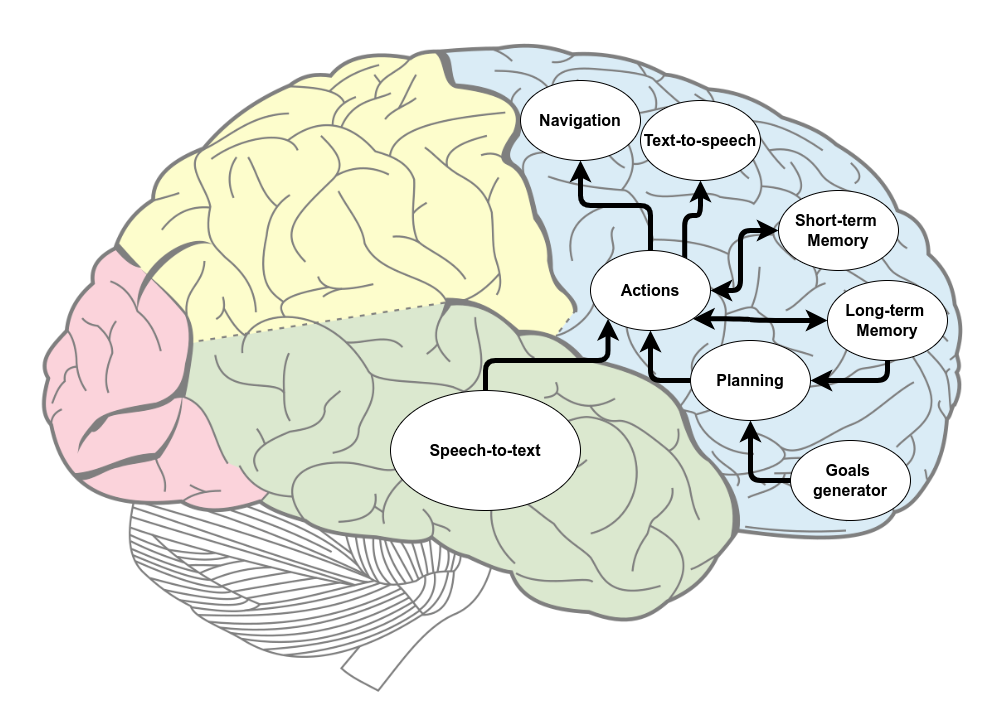
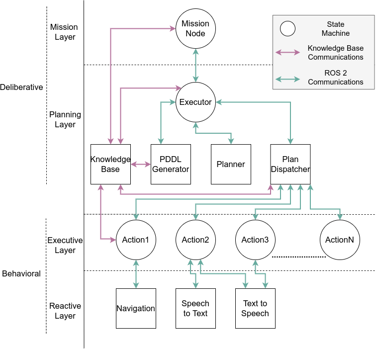

************
Architecture
************

MERLIN2, which comes from MachinEd Ros 2 pLannINg, is a hybrid architecture 
composed of four layers. It is the evolution of `MERLIN <https://www.mdpi.com/2076-3417/10/17/5989>`_
Its main aim is to produce behaviors to face the daily tasks of a service 
robot. As a result, symbolic knowledge management is needed to represent 
the state of the world. Besides, state machines are used to implement 
small subtasks.

On the other hand, knowledge managing is achieved using `KANT (Knowledge mAnagemeNT) <https://github.com/uleroboticsgroup/kant>`_, 
which allows querying, creation, and edit deletion of PDDL-based knowledge. 
On the other hand, state machines are implemented with `YASMIN (Yet Another State MachINe) <https://github.com/uleroboticsgroup/yasmin>`_, 
which is a library to develop behaviors using state machines. Each of those 
state machines uses a blackboard to share data between all the states and 
nested state machines. However, it is necessary to find out the biological 
nature of cognitive systems from the point of view of a human.

In nature, these cognitive functions are performed by some cerebrum lobes of 
the human brain. The human cerebrum is composed of four structures called 
prefrontal, temporal, occipital and parietal. As a result of building 
MERLIN2 with the presented tools, the high-level architecture diagram 
presented in figure is obtained. The prefrontal lobe has 
most of the modules from MERLIN2. It is in charge of memory, which is divided 
into long-term and short-term. The long-term memory, which represents the 
state of the environment, corresponds with the knowledge base managed by KANT.
The short-term memory corresponds with the blackboards of the state machines 
of YASMIN. Besides, long-term memory is used in the planning process to choose
the actions that the robot has to use to achieve its goals. These actions are 
implemented with YASMIN state machines and can also manage the knowledge of 
long-term memory. Finally, actions can use the navigation, text-to-speech and 
speech-to-text modules to interact with the environment and humans. 
The prefrontal lobe is also in charge of motor control, navigation, and 
speech production, text-to-speech; while the temporal lobe is in charge of 
the audio processing, speech-to-text.

MERLIN2 is composed of two main systems: the Deliberative and the Reactive.
Both of thm are divided into two layers: Mission Layer, Planning Layer,
Executive Layer and Reactive Layer.

Mission Layer
============

This layer is in charge of generating the high-level goals of the robots. 
These goals consist of facts that the robots want to be true. 
In addition, it can be used to create the initial state, 
which is composed of the initial objects and facts of the environment.

Planning Layer
==============

This layer is in charge of generating plans to achieve high-level goals. 
It is composed of five components:

* **Knowledge Base**: this component is the knowledge base of KANT, which corresponds with long-term memory. It stores the knowledge of the environment. There are two types of knowledge base depending on the storage type: a ROS 2 node that stores in process memory the knowledge and a MongoDB~\cite{bradshaw2019mongodb} database, which is more persistent.
* **PDDL Generator**: this component is in charge of generating the PDDL text from the knowledge base.
* **Planner**: this component uses the PDDL text to create plans. Several PDDL planners can be used. The available planners are POPF, SMTP, unified-planning and VHPOP.
* **Plan Dispatcher**: this component is in charge of executing the actions of the generated plan. It also has to cancel the current action if needed.   
* **Executor**: this component is a facade between this layer and the Mission Layer. It executed its component of this layer and cancel the Plan Dispatcher.

Executive Layer
===============

This layer is composed of the actions that the robot can carry out. 
These actions are used to create plans. Each action has the capability 
to register automatically in the knowledge base, which means creating a 
PDDL action. Besides, these actions are implemented as YASMIN state machines. 
As has been mentioned before, the blackboard of the state machines is the 
short-term memory, that stores the initial objects needed by the PDDL 
action and the partial solution of the state machine. Besides, YASMIN has 
a viewer that can be used to monitor the actions at a high level. 
Finally, new actions can be developed so that the robot can perform other 
tasks. As a result, more complex behaviors can be implemented.

Reactive Layer
==============

This layer provide the set of software  mechanisms that provide
bounded and specific applications that would be considered as robot skills
such as navigation, text-to-speech or sound recognitio
This layer is composed of the low-level systems:

* Navigation: this component corresponds with `Nav2 <https://navigation.ros.org/>`_, which is the navigation system of ROS 2.
* Speech-to-text: this component is in charge of listening for speech and converting it to text.
* Text-to-speech: this component is in charge of producing speech from a sentence.
