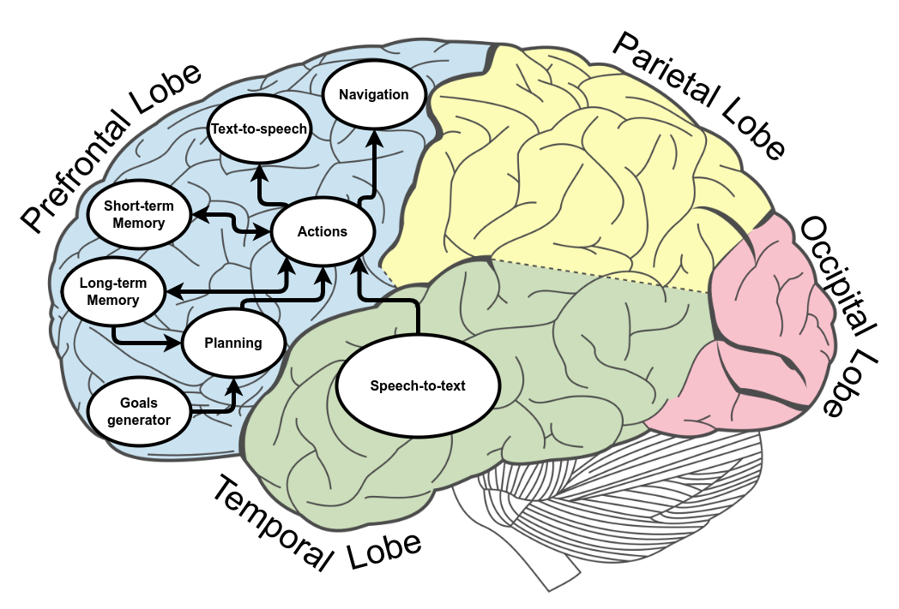

************
Architecture
************

MERLIN2, which comes from MachinEd Ros 2 pLannINg, is a software architecture 
that represents the paradigm of a hybrid cognitive architecture for robots 
composed of four layers. It is the evolution of `MERLIN <https://www.mdpi.com/2076-3417/10/17/5989>`_.
MERLIN2 aims to speed up the process of producing robot behaviors to face 
the daily short and long-term tasks of a service robot using ROS 2. 

On the one hand, it also includes a component for knowledge managing, a tool 
called `KANT (Knowledge mAnagemeNT) <https://github.com/uleroboticsgroup/kant>`_, 
which allows querying, creation, and edit deletion of 
PDDL-based knowledge. On the other hand, it includes a component for behavior 
generation and manipulation called `YASMIN (Yet Another State MachINe) <https://github.com/uleroboticsgroup/yasmin>`_. 
YASMIN is a library to develop robot behaviors using state machines. 
Each of those state machines uses a blackboard to share data between 
all the states and nested state machines. Thus, the current organization 
and development of MERLIN2 components and solutions are bioinspired. 

In nature, cognitive functions such as short memory, perception or sensory-motor; 
are performed by some cerebrum lobes of the human brain. Organizing MERLIN2 components 
as cerebrum cognitive functions gave us the sketch presented in the following image. 
The human cerebrum is composed of four structures called prefrontal, temporal, occipital and 
parietal. The prefrontal lobe has most of the modules from MERLIN2. It is in charge 
of memory, which is divided into long-term and short-term. The long-term memory, which 
represents the state of the environment, corresponds with the knowledge base managed by KANT. 
The short-term memory corresponds with the blackboards of the state machines of YASMIN. 
Besides, long-term memory is used in the planning process to choose the actions that the robot 
has to use to achieve its goals. These actions are implemented with YASMIN state machines and 
can also manage the knowledge of long-term memory. Finally, actions can use the navigation, 
text-to-speech and speech-to-text modules to interact with the environment and humans. The 
prefrontal lobe is also in charge of motor control, navigation, and speech production, 
text-to-speech; while the temporal lobe is in charge of the audio processing, speech-to-text.

When moving all these cognitive functions to a classic software perspective we find 
the folowing diagram. The figure presents in detail the MERLIN2 architecture technically 
divided into four layers associated with hybrid and multi-layer cognitive proposals. 

.. image:: ../images/architecture.png

Mission Layer
============

This layer is in charge of generating the high-level goals of the robots. 
These goals are related to robot duty, particular works that are internally 
or externally motivated, which means that are bred from the proprioceptive or
exteroceptive stimulus (low battery status or human request). 

The software component at this layer sets the goals of the robot in a given 
instant. That goal starts from an initial state made of current environment 
facts and sets the facts that the robots want to be true. 

Planning Layer
==============

This layer is in charge of generating plans to achieve high-level goals 
previously created. It is associated with the classic Deliberative subsystem 
and requires formal representation of the environment, plan solvers, task 
dispatcher, and execution.

MERLIN2 proposes a set of five components for this layer:

* **Knowledge Base**: this component is the knowledge base of KANT, which 
corresponds with long-term memory. It stores the knowledge of the environment. 
There are two types of knowledge base depending on the storage type: a ROS 2 
node that stores in process memory the knowledge and a MongoDB database, which 
is more persistent.

* **PDDL Generator**: this component is in charge of generating the PDDL text from the knowledge base.

* **Planner**: this component uses the PDDL text to create plans. Several PDDL 
planners can be used. The available planners are POPF, SMTP, unified-planning 
and VHPOP.

* **Plan Dispatcher**: this component is in charge of executing the actions 
of the generated plan. It also has to cancel the current action if needed.   

* **Executor**: this component is a facade between this layer and the 
Mission Layer. It executed its component of this layer and cancel the Plan Dispatcher.

Executive Layer
===============

This layer is composed of the actions that the robot can carry out. 
These actions compose the plans generated by the Planning Layer.

When an action is instantiated, its associated knowledge is saved in 
the knowledge base. Besides, these actions are implemented as YASMIN 
state machines. As has been mentioned before, the blackboard of the 
state machines is the short-term memory, that stores the initial objects 
needed by the PDDL action and the partial solution of the state machine. 
Besides, YASMIN has a viewer that can be used to monitor the actions at 
a high level. Finally, new actions can be developed so that the robot 
can perform other tasks. As a result, more complex behaviors can be implemented.

Reactive Layer
==============

This layer provides the set of software  components that bring
bounded and specific applications that would be considered robot skills
such as navigation (world exploration), text-to-speech (talking) or sound recognition (listening). 

This version of MERLIN2 includes three specific components that 
are suitable for validating the use of the cognitive architecture:

* **Navigation**: this component corresponds with `Nav2 <https://navigation.ros.org/>`_, which is the navigation system of ROS 2.
* **Speech-to-text**: this component is in charge of listening for speech and converting it to text.
* **Text-to-speech**: this component is in charge of producing speech from a sentence.
